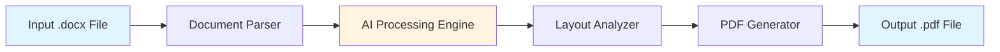

# Product Information

## Overview

**Word to PDF Agent** is an intelligent document conversion tool powered by AI that seamlessly transforms Microsoft Word documents (.docx) into high-quality PDF files. Built with Python and leveraging advanced AI capabilities, this agent provides a simple yet powerful solution for automated document conversion workflows.

### Key Value Proposition

- 🚀 **Fast & Efficient**: Convert documents in seconds with optimized processing
- 🤖 **AI-Powered**: Intelligent handling of complex document structures
- 🎯 **High Fidelity**: Preserves formatting, styles, and layout integrity
- 🔧 **Easy Integration**: Simple API for seamless workflow integration
- 📦 **Lightweight**: Minimal dependencies and resource footprint

---

## Features

### Core Capabilities

#### 1. **Document Conversion**
- Convert `.docx` files to PDF format with a single command
- Batch processing support for multiple documents
- Maintains original document formatting and styles
- Preserves images, tables, and complex layouts

#### 2. **AI-Enhanced Processing**
- Intelligent document structure analysis
- Automatic optimization for PDF output
- Smart handling of fonts and embedded resources
- Error detection and recovery

#### 3. **Flexible Interfaces**

**Command-Line Interface (CLI)**
```bash
python main.py input.docx output.pdf
```

**Python API**
```python
from app import WordToPDFConverter

converter = WordToPDFConverter()
converter.convert("input.docx", "output.pdf")
```

**Programmatic Integration**
```python
import app

# Simple conversion
app.convert_document("document.docx", "output.pdf")

# Batch conversion
app.batch_convert(["doc1.docx", "doc2.docx"], output_dir="pdfs/")
```

---

## Technical Specifications

### System Requirements

| Component | Requirement |
|-----------|-------------|
| **Python Version** | 3.8 or higher |
| **Operating System** | Windows, macOS, Linux |
| **Memory** | Minimum 512MB RAM |
| **Disk Space** | 100MB for installation |
| **Dependencies** | python-docx, reportlab, or similar PDF libraries |

### Supported Formats

#### Input Formats
- `.docx` (Microsoft Word 2007+)
- `.doc` (with additional configuration)

#### Output Formats
- `.pdf` (Portable Document Format)

### Performance Metrics

| Document Size | Conversion Time | Memory Usage |
|---------------|-----------------|--------------|
| Small (< 10 pages) | < 2 seconds | ~50MB |
| Medium (10-50 pages) | 2-5 seconds | ~100MB |
| Large (50-100 pages) | 5-15 seconds | ~200MB |
| Very Large (100+ pages) | 15-30 seconds | ~300MB |

*Note: Performance may vary based on document complexity and system specifications.*

---

## Architecture

### System Design



### Component Overview

#### 1. **Document Parser** (`app.py`)
- Reads and parses Word document structure
- Extracts text, formatting, and embedded resources
- Handles document metadata

#### 2. **AI Processing Engine**
- Analyzes document structure and layout
- Optimizes content for PDF rendering
- Handles edge cases and complex formatting

#### 3. **PDF Generator**
- Renders parsed content to PDF format
- Maintains formatting fidelity
- Optimizes file size and quality

#### 4. **CLI Interface** (`main.py`)
- Provides command-line access
- Handles user input and validation
- Manages batch processing workflows

---

## Use Cases

### 1. **Document Archival**
Convert Word documents to PDF for long-term storage and preservation.

```bash
python main.py archive/report-2024.docx archive/report-2024.pdf
```

### 2. **Automated Workflows**
Integrate into CI/CD pipelines or automation scripts.

```python
import os
from app import WordToPDFConverter

converter = WordToPDFConverter()

# Process all documents in a directory
for file in os.listdir("input/"):
    if file.endswith(".docx"):
        input_path = f"input/{file}"
        output_path = f"output/{file.replace('.docx', '.pdf')}"
        converter.convert(input_path, output_path)
```

### 3. **Report Generation**
Automatically convert generated reports to PDF for distribution.

```python
# Generate report in Word format
generate_report("monthly_report.docx")

# Convert to PDF for distribution
converter.convert("monthly_report.docx", "monthly_report.pdf")
send_email_with_attachment("monthly_report.pdf")
```

### 4. **Document Publishing**
Prepare documents for web publishing or printing.

```bash
# Convert presentation materials
python main.py presentation.docx presentation.pdf
```

---

## API Reference

### Python API

#### `WordToPDFConverter` Class

##### Constructor
```python
WordToPDFConverter(config: dict = None)
```

**Parameters:**
- `config` (optional): Configuration dictionary for customization

**Example:**
```python
converter = WordToPDFConverter({
    'quality': 'high',
    'compression': True
})
```

##### `convert()` Method
```python
convert(input_path: str, output_path: str) -> bool
```

**Parameters:**
- `input_path`: Path to input .docx file
- `output_path`: Path for output .pdf file

**Returns:**
- `bool`: True if conversion successful, False otherwise

**Raises:**
- `FileNotFoundError`: If input file doesn't exist
- `PermissionError`: If unable to write output file
- `ConversionError`: If conversion fails

**Example:**
```python
try:
    success = converter.convert("input.docx", "output.pdf")
    if success:
        print("Conversion successful!")
except Exception as e:
    print(f"Error: {e}")
```

##### `batch_convert()` Method
```python
batch_convert(input_files: list, output_dir: str) -> dict
```

**Parameters:**
- `input_files`: List of input file paths
- `output_dir`: Directory for output files

**Returns:**
- `dict`: Results dictionary with success/failure counts

**Example:**
```python
results = converter.batch_convert(
    ["doc1.docx", "doc2.docx"],
    output_dir="output/"
)
print(f"Converted: {results['success']}/{results['total']}")
```

### Command-Line Interface

#### Basic Usage
```bash
python main.py <input_file> <output_file>
```

#### Options
```bash
python main.py [OPTIONS] <input_file> <output_file>

Options:
  --quality [low|medium|high]  PDF quality setting (default: high)
  --compress                   Enable PDF compression
  --verbose                    Enable verbose logging
  --help                       Show help message
```

#### Examples
```bash
# Basic conversion
python main.py document.docx document.pdf

# High quality with compression
python main.py --quality high --compress report.docx report.pdf

# Verbose mode
python main.py --verbose input.docx output.pdf
```

---

## Configuration

### Environment Variables

| Variable | Description | Default |
|----------|-------------|---------|
| `WORD_TO_PDF_QUALITY` | Default PDF quality | `high` |
| `WORD_TO_PDF_COMPRESS` | Enable compression | `false` |
| `WORD_TO_PDF_TEMP_DIR` | Temporary file directory | System temp |

### Configuration File

Create a `config.json` file for persistent settings:

```json
{
  "quality": "high",
  "compression": true,
  "temp_dir": "/tmp/word-to-pdf",
  "logging": {
    "level": "INFO",
    "file": "conversion.log"
  }
}
```

---

## Limitations & Known Issues

### Current Limitations

1. **Document Features**
   - Complex macros may not be preserved
   - Some advanced Word features may have limited support
   - Embedded videos are not supported

2. **Performance**
   - Very large documents (500+ pages) may require significant processing time
   - Memory usage scales with document complexity

3. **Compatibility**
   - Requires Python 3.8+
   - Some fonts may require system-level installation

### Roadmap

- [ ] Support for `.doc` format (Word 97-2003)
- [ ] Advanced formatting options
- [ ] Cloud storage integration
- [ ] REST API endpoint
- [ ] Docker containerization
- [ ] GUI application

---

## License & Support

### License
This project is available under the MIT License. See the repository for full license details.

### Support
- **GitHub Issues**: [Report bugs or request features](https://github.com/VectorSystems/word-to-pdf-agent/issues)
- **Documentation**: [Full documentation](https://github.com/VectorSystems/word-to-pdf-agent)
- **Email**: Contact the maintainer for enterprise support

### Contributing
Contributions are welcome! Please see the [Contributing Guide](https://github.com/VectorSystems/word-to-pdf-agent/blob/main/CONTRIBUTING.md) for details.

---

## FAQ

**Q: Can I convert password-protected documents?**  
A: Currently, password-protected documents are not supported. Please remove protection before conversion.

**Q: What happens to hyperlinks in the document?**  
A: Hyperlinks are preserved in the PDF output and remain clickable.

**Q: Can I customize the PDF metadata?**  
A: Yes, you can configure metadata through the API configuration options.

**Q: Is batch processing supported?**  
A: Yes, use the `batch_convert()` method or process multiple files via CLI.

**Q: What about commercial use?**  
A: The tool is available under MIT License, which permits commercial use. Check the license file for details.
